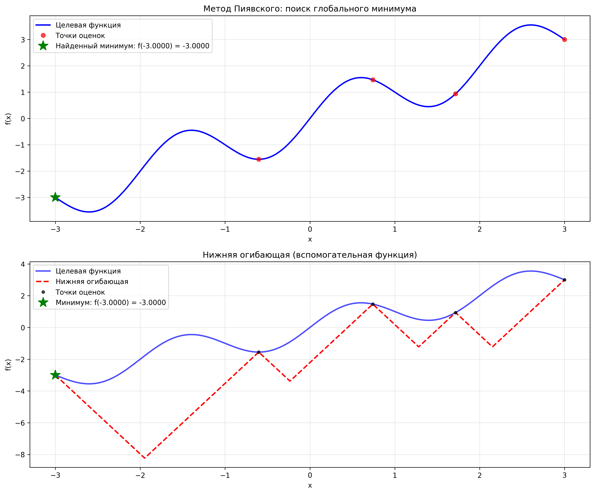

# Решение задачи глобальной оптимизации методом Пиявского

## Ф.И.О.
Захматов Юрий Дмитриевич

## Поток
МЕТОПТ 1.2

## Вариант 
Задача глобальной оптимизации унимодальной функции методом Пиявского

Целевая функция: 
f(x) = x + sin(3.14159*x)

Интервал: [-3, 3]
Точность: 0.01

## Краткое описание алгоритма метода Пиявского

Метод Пиявского (также известный как метод ломаных или метод сильных огибающих) - это детерминированный алгоритм глобальной оптимизации для липшицевых функций.

### Основные этапы алгоритма:

1. **Инициализация**
   - Задается интервал [a, b] и константа Липшица L
   - Если L неизвестна, оценивается автоматически
   - Вычисляются значения функции в граничных точках

2. **Оценка константы Липшица** (если не задана)
   - Функция равномерно sampling на интервале
   - Вычисляются разности между соседними точками
   - Берется максимальная разность с запасом 20%

3. **Построение нижней огибающей**
   - Для каждой пары соседних точек (x₁, x₂) строится "ломаная" - линейная функция, проходящая через точки (x₁, f(x₁)-L|x-x₁|) и (x₂, f(x₂)-L|x-x₂|)
   - Нижняя огибающая - это максимум всех таких ломаных

4. **Выбор следующей точки**
   - Находится точка с минимальным значением нижней огибающей
   - Эта точка гарантированно содержит потенциальное улучшение
   - Вычисляется характеристика - значение огибающей в кандидатной точке

5. **Критерий остановки**
   - Разница между текущим минимумом и нижней оценкой (gap) ≤ ε
   - Достигнуто максимальное число итераций

6. **Визуализация результатов**
   - Строятся графики целевой функции и нижней огибающей
   - Отмечаются все вычисленные точки

## Математическая основа

Для функции f(x), удовлетворяющей условию Липшица:
|f(x₁) - f(x₂)| ≤ L|x₁ - x₂|

Строится вспомогательная функция (нижняя огибающая):
φ(x) = maxᵢ [f(xᵢ) - L|x - xᵢ|]

Свойства:
- φ(x) ≤ f(x) для всех x ∈ [a, b]
- Минимум φ(x) дает нижнюю оценку для глобального минимума f(x)

## Инструкция по развертыванию и запуску программы

### Требования
- Python 3.7 или выше
- Библиотеки: NumPy, Matplotlib

### Установка зависимостей
```bash
pip install numpy matplotlib
```

### Запуск программы

```text
python lab2.py
```

### Структура программы 

Структура программы
Класс PiyavskyOptimizer - основная реализация алгоритма

estimate_lipschitz() - оценка константы Липшица

find_next_point() - выбор следующей точки для вычисления

optimize() - основной цикл оптимизации

plot_results() - визуализация результатов

Функция custom_function(x) - целевая функция для оптимизации

### Вывод программы

```text
"E:\ITMO\3 course\МетОпт\МетОпт\.venv\Scripts\python.exe" "E:\ITMO\3 course\МетОпт\МетОпт\ITMO_MetOptRep\Lab2\lab2.py" 
Программа для поиска глобального экстремума методом Пиявского
Целевая функция: f(x) = x + sin(3.14159*x)
============================================================
Интервал: [-3.0, 3.0]
Точность: 0.01
============================================================
Используемая константа Липшица: 4.9699
Начальный минимум: f(-3.0000) = -3.0000
Итерация  1: x= -0.6036, gap= 11.9095
Итерация  2: x=  0.7403, gap=  5.2303
Итерация  3: x=  1.7161, gap=  0.3808
Итерация  4: x=  2.1506, gap= -1.7785
Достигнута точность -1.778474 <= 0.01

============================================================
РЕЗУЛЬТАТЫ ОПТИМИЗАЦИИ
============================================================
Найденный минимум:
  x* = -3.000000
  f(x*) = -3.000008
Количество итераций: 4
Количество оценок функции: 5
Время выполнения: 0.0010 секунд

Проверка (грубым перебором 10000 точек):
  Истинный минимум: x = -2.603360, f(x) = -3.551104
  Ошибка по x: 0.396640
  Ошибка по f(x): 0.551096
График сохранен: piyavsky_optimization_result.png

Process finished with exit code 0
```

### Визуализация результатов

Программа генерирует график с двумя панелями:

Верхняя панель: целевая функция и точки вычислений

Нижняя панель: целевая функция и нижняя огибающая



### Проверка корректности

Программа включает встроенную проверку путем грубого перебора (10000 точек), что позволяет:

- Верифицировать найденный минимум

- Оценить точность метода

- Убедиться в корректности работы алгоритма


### Вывод

Вывод
Реализация метода Пиявского позволила глубоко понять принципы глобальной оптимизации.
